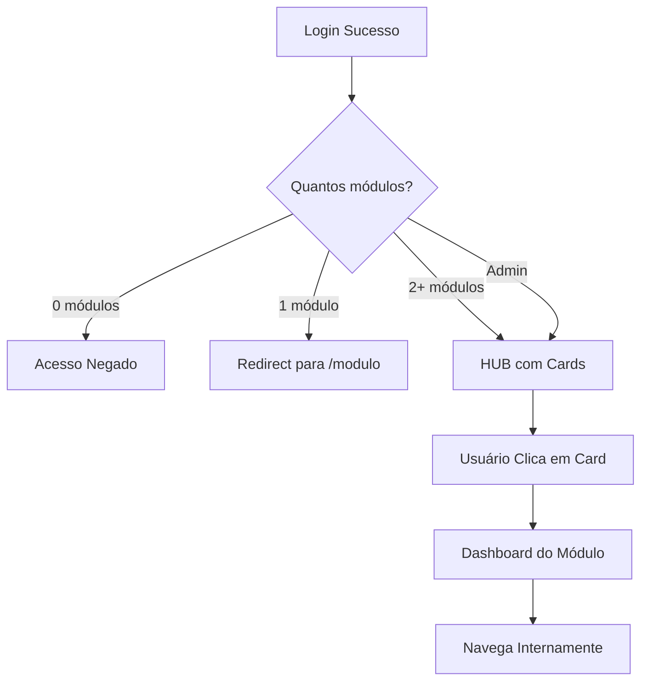

# Sistema de Navegação por Módulos — IDJUV

## Data: 2026-02-08
## Versão: 1.0.0

---

## Resumo da Refatoração

Implementação de um sistema de navegação baseado em módulos que garante que cada usuário veja apenas as áreas às quais tem acesso.

---

## Comportamento por Tipo de Usuário

| Quantidade de Módulos | Comportamento |
|-----------------------|---------------|
| 0 módulos | Redirect para `/acesso-negado?reason=no-modules` |
| 1 módulo | Redirect automático para o dashboard do módulo (ex: `/rh`) |
| 2+ módulos | Mostra HUB com cards clicáveis para cada módulo |
| Admin | Acesso total a todos os 13 módulos via HUB |

---

## Rotas de Módulos

| Módulo | Rota Dashboard | Descrição |
|--------|---------------|-----------|
| admin | `/admin` | Administração do sistema |
| rh | `/rh` | Recursos Humanos |
| financeiro | `/financeiro` | Orçamento e pagamentos |
| compras | `/compras` | Licitações e aquisições |
| contratos | `/contratos` | Gestão contratual |
| patrimonio | `/patrimonio` | Bens e inventário |
| workflow | `/workflow` | Processos administrativos |
| governanca | `/governanca` | Estrutura organizacional |
| transparencia | `/transparencia` | Portal LAI |
| programas | `/programas/bolsa-atleta` | Programas sociais |
| comunicacao | `/comunicacao` | ASCOM |
| integridade | `/integridade` | Ética e compliance |
| gestores_escolares | `/gestores-escolares` | Credenciamento JER |

---

## Arquivos Criados

### Hooks
- `src/hooks/useModuleRouter.ts` — Lógica de roteamento por módulo

### Páginas
- `src/pages/sistema/SistemaEntryPage.tsx` — Página de entrada com lógica de redirect
- `src/pages/sistema/ModuleHubPage.tsx` — HUB com cards de módulos

### Dashboards de Módulo
- `src/pages/modulos/RHDashboardPage.tsx`
- `src/pages/modulos/FinanceiroDashboardPage.tsx`
- `src/pages/modulos/PatrimonioDashboardPage.tsx`
- `src/pages/modulos/ComprasDashboardPage.tsx`
- `src/pages/modulos/ContratosDashboardPage.tsx`
- `src/pages/modulos/GovernancaDashboardPage.tsx`
- `src/pages/modulos/WorkflowDashboardPage.tsx`
- `src/pages/modulos/TransparenciaDashboardPage.tsx`
- `src/pages/modulos/ComunicacaoDashboardPage.tsx`
- `src/pages/modulos/ProgramasDashboardPage.tsx`
- `src/pages/modulos/IntegridadeDashboardPage.tsx`
- `src/pages/modulos/GestoresEscolaresDashboardPage.tsx`

### Componentes
- `src/components/modules/ModuleDashboard.tsx` — Template reutilizável para dashboards

---

## Arquivos Modificados

- `src/App.tsx` — Novas rotas para módulos
- `src/pages/AccessDeniedPage.tsx` — Suporte para motivo "no-modules"

---

## Fluxo de Navegação

---

## Componentes do Dashboard de Módulo

Cada dashboard de módulo inclui:

1. **Hero Section** — Título, descrição e ícone com gradiente colorido
2. **Stats Cards** — 4 indicadores principais com links
3. **Ações Rápidas** — 4 botões para funcionalidades mais usadas
4. **Navegação do Módulo** — Grid com todos os links internos

---

## Prioridade de Módulos

Ordem de exibição no HUB:

1. Administração
2. Recursos Humanos
3. Financeiro
4. Compras
5. Contratos
6. Patrimônio
7. Processos
8. Governança
9. Transparência
10. Programas
11. Comunicação
12. Integridade
13. Gestores Escolares

---

## Compatibilidade

✅ Todas as rotas existentes continuam funcionando
✅ Menu lateral filtra por módulos (existente)
✅ RBAC via `user_roles` e `user_modules`
✅ Dev Mode Switcher funciona para simular diferentes perfis
✅ Dashboard legado preservado em `/admin`

---

## Próximos Passos

1. Integrar dados reais nos KPIs dos dashboards
2. Adicionar filtro de módulos no MenuSidebar quando em contexto de módulo
3. Implementar tracking de módulos mais acessados por usuário
